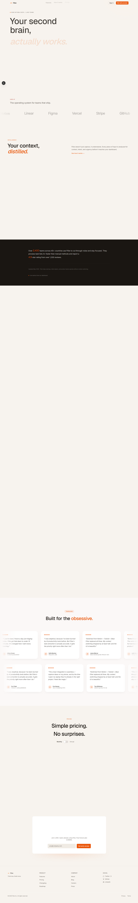

# Flow — SaaS Landing (Project 01)

**Flow** is a modern SaaS landing page template designed for productivity and task management solutions. Built with Next.js 16, Tailwind CSS, and Framer Motion, it demonstrates professional design patterns and conversion-focused UX.



## Overview

Flow showcases a complete SaaS landing page with:
- **Hero Section** — Compelling headline with beta badge and CTAs
- **Feature Showcase** — Interactive component grid highlighting key benefits
- **Pricing Section** — Flexible pricing tiers with feature comparison
- **Social Proof** — Testimonials and user statistics
- **Footer** — Links and brand presence

## Tech Stack

- **Framework**: Next.js 16 (App Router)
- **Styling**: Tailwind CSS 3
- **Animation**: Framer Motion for smooth transitions
- **Icons**: Lucide React + custom SVGs
- **Typography**: Geist font (Vercel)
- **Shared UI**: `@agency/shared` component library

## Quick Start

### Prerequisites
- Node 18+
- pnpm 10.x

### Installation & Development

```bash
# Install dependencies
pnpm install

# Start dev server
pnpm dev
```

Open [http://localhost:3000](http://localhost:3000) to view the site.

### Production Build

```bash
pnpm build
pnpm start
```

## Project Structure

```
src/
├── app/
│   ├── page.tsx          # Main landing page
│   ├── layout.tsx        # Root layout with metadata
│   └── globals.css       # Global styles
└── components/
    ├── sections/         # Page sections (Hero, Features, Pricing)
    ├── ui/              # Reusable UI components
    └── layout/          # Header, Footer, Navigation
```

## Key Features

### 1. **Responsive Design**
- Mobile-first approach with Tailwind breakpoints
- Optimized for all screen sizes (mobile, tablet, desktop)

### 2. **Performance**
- Image optimization via Next.js Image component
- Code splitting and lazy loading
- Font optimization with `next/font`

### 3. **SEO Ready**
- Semantic HTML structure
- Meta tags and Open Graph support
- Structured data for rich snippets

### 4. **Accessibility**
- ARIA labels and semantic elements
- Keyboard navigation support
- Color contrast compliance

## Customization Guide

### Colors & Branding
Edit `tailwind.config.ts` to update the color palette, then modify component variants in `src/components/ui/`.

### Content
- Main content: `src/app/page.tsx`
- Section copy: `src/components/sections/`
- Product info: See `PRODUCT.md`

### Animations
Framer Motion animations can be adjusted in component files:
- Adjust `duration`, `delay`, and `stiffness` values
- See `src/components/animations/` for reusable animation presets

## Dependencies

Key dependencies from `package.json`:
- `next`: 16.2.x — React framework
- `react`: 19.x — UI library
- `framer-motion`: ^11.x — Animation library
- `tailwindcss`: ^4.x — Utility CSS
- `@agency/shared`: Monorepo shared components

## Deployment

### Vercel (Recommended)
```bash
vercel deploy
```

### Other Platforms
Build and deploy the `out/` directory:
```bash
pnpm build
# Deploy the `.next` folder to your hosting
```

## Notes

- **Workspace Dependency**: This project consumes `@agency/shared` from the monorepo. To use standalone:
  - Publish `@agency/shared` to npm, or
  - Use `pnpm install --workspace-root`
- **See Also**: Check `PRODUCT.md` for detailed product and copy strategy

## License

MIT — Feel free to use this template for commercial projects.

## Learn More

To learn more about Next.js, take a look at the following resources:

- [Next.js Documentation](https://nextjs.org/docs) - learn about Next.js features and API.
- [Learn Next.js](https://nextjs.org/learn) - an interactive Next.js tutorial.

You can check out [the Next.js GitHub repository](https://github.com/vercel/next.js) - your feedback and contributions are welcome!

## Deploy on Vercel

The easiest way to deploy your Next.js app is to use the [Vercel Platform](https://vercel.com/new?utm_medium=default-template&filter=next.js&utm_source=create-next-app&utm_campaign=create-next-app-readme) from the creators of Next.js.

Check out our [Next.js deployment documentation](https://nextjs.org/docs/app/building-your-application/deploying) for more details.
